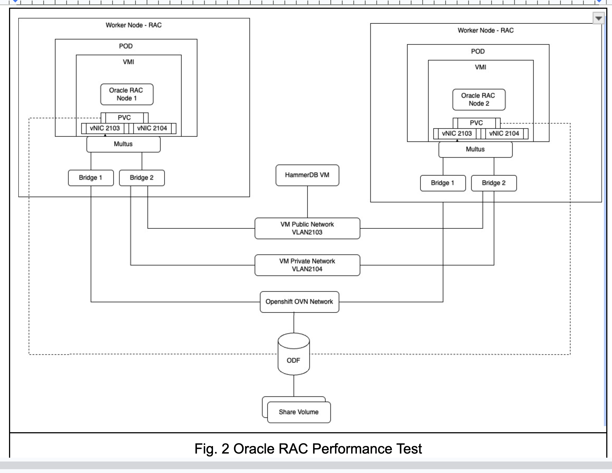

# Oracle Benchmarking & Observability on OpenShift Virtualization

This repository automates the setup and execution of **Oracle database benchmarks** using **HammerDB** and **SwingBench** on RHEL VMs provisioned via OpenShift Virtualization. We leverage Ansible for provisioning and configuring the environment, enabling automated benchmark execution with comprehensive observability through Grafana dashboards.

## Project Functionality

This project provides comprehensive tooling to automate **Oracle database performance testing** using industry-standard benchmarks:

### 🔨 **HammerDB TPC-C Benchmarks**
- Automated [HammerDB](https://hammerdb.com/) deployment and configuration
- TPC-C workload execution with configurable profiles (small, medium, large)
- Automated schema creation and benchmark execution

### 🏌️ **SwingBench SOE Benchmarks**
- [SwingBench](https://www.dominicgiles.com/swingbench.html) Sales Order Entry (SOE) benchmarks
- JDK 11 prerequisite checking and installation
- Comprehensive schema building and benchmark execution

### 🚀 **Ansible Automation**
Included **Ansible playbooks** handle:
- Installation of Oracle Instant Client tools
- Deployment of HammerDB and SwingBench
- Configuration via custom scripts and TNS configuration
- Organized directory structure for easy management
- **Selective tool installation** using the `benchmark_tool` variable

### 📊 **Observability Integration**
Beyond benchmarking, this solution provides:
- **Prometheus-compatible metric collection** from Oracle DB using the Oracle Observability Exporter
- **Visualization of metrics** through pre-configured Grafana dashboards on OpenShift
- **AWR report generation** for detailed performance analysis

---

## Oracle RAC Performance Test Architecture



---

## Project Structure

### Repository Organization
```
oracle-ocpv-benchmark-eco/
├── ansible/                                         # Ansible automation
│   ├── main_setup_complete_benchmark_suite.yml         # Complete installation (Oracle client + TNS + HammerDB + SwingBench)
│   ├── main_setup_conditional_benchmark.yml            # Conditional installation based on benchmark_tool variable
│   ├── main_setup_oracle_hammerdb_benchmark.yml        # HammerDB setup (Oracle client + TNS + HammerDB)
│   ├── main_setup_oracle_swingbench_benchmark.yml      # SwingBench setup (Oracle client + TNS + SwingBench)
│   ├── inventory.yaml                                   # Ansible inventory configuration
│   ├── vars/                                            # Variable files
│   │   ├── common.yml                                   # Common variables (TNS, Oracle client, system config)
│   │   ├── hammerdb.yml                                 # HammerDB-specific variables
│   │   └── swingbench.yml                               # SwingBench-specific variables
│   ├── playbooks/                                       # Individual component playbooks
│   │   ├── oracle-client/                               # Oracle Instant Client installation
│   │   ├── configure-tnsnames/                          # TNS configuration
│   │   ├── setup-hammerdb/                              # HammerDB installation
│   │   └── setup-swingbench/                            # SwingBench installation
│   ├── scripts/                                         # Source scripts organized by tool
│   │   ├── hammerdb/                                    # HammerDB source scripts
│   │   │   ├── build.sh, run.sh, build-and-run.sh      # Main execution scripts
│   │   │   ├── build.tcl, run.tcl, scalerun.tcl        # TCL benchmark scripts
│   │   │   ├── generate_awr_html_report.sh              # AWR report generation
│   │   │   └── awr_reports/                             # AWR report templates
│   │   └── swingbench/                                  # SwingBench source scripts
│   │       ├── build-soe-schema.sh                      # SOE schema builder
│   │       ├── run-soe-benchmark.sh                     # SOE benchmark runner
│   │       ├── build-and-run-soe.sh                     # Combined build and run
│   │       └── cleanup-soe-schema.sh                    # Schema cleanup
│   └── templates/                                       # Ansible Jinja2 templates
│       ├── hammerdb.env.j2                              # HammerDB environment config
│       ├── swingbench.env.j2                            # SwingBench environment config
│       └── tnsnames.ora.j2                              # TNS configuration template
├── docs/                                                # Documentation
│   ├── directory-structure.md                           # Detailed directory structure
│   ├── swingbench-setup-guide.md                        # SwingBench setup guide
│   └── setup-grafana.md                                # Grafana dashboard setup
└── oracle-metrics/                                     # Observability components
    ├── oracle-observability-exporter-deployment.yaml
    ├── oracle-servicemonitor.yaml
    └── setup-oracle-exporter.md
```

### Target VM Directory Structure
After deployment, the target VM will have this organized structure:
```
/opt/ocpv-benchmark/                            # Base installation directory
├── hammerdb/4.12/                              # HammerDB installation
├── swingbench/20231104_jdk11/                  # SwingBench installation (Nov 2023, JDK 11)
├── scripts/                                    # Benchmark execution scripts
│   ├── hammerdb/                               # HammerDB scripts + results
│   └── swingbench/                             # SwingBench scripts + results
└── tns/                                        # Shared TNS configuration
    └── tnsnames.ora
```

---

## Requirements

### System Requirements
- **Target VM**: RHEL 8/9 VM managed on OpenShift Virtualization
- **Control Machine**: Linux/macOS with Python + Ansible installed
- **Oracle Database**: Oracle 12c+ (standalone or RAC)
- **OpenShift Cluster**: For observability stack (optional)

### Software Requirements
- **Ansible**: Version 2.9+ (tested with 2.9-2.15)
- **Python**: 3.6+
- **OpenShift CLI**: `oc` (for observability features)
- **SSH Access**: Password-less SSH to target VMs

### Ansible Installation
```bash
# Install Ansible
pip install ansible

# Verify installation
ansible --version
```

---

## Quick Start

### 1. Configure Ansible Inventory

Edit `ansible/inventory.yaml` to define your target VMs:

```yaml
all:
  children:
    oracle_benchmark_client_vms:
      hosts:
        oralab_vm1:
          ansible_host: <vm-ip-address>           # Your VM IP
          ansible_user: <vm-username>             # VM user (e.g., cloud-user)
          ansible_ssh_private_key_file: ~/.ssh/id_rsa  # SSH key path
      vars:
        # Benchmark tool selection (enum: "hammerdb", "swingbench", "all")
        benchmark_tool: all                      # Default: install both tools
```

### 2. Configure Variables

The project uses modular variable files for better organization:

#### `vars/common.yml` - Common Configuration
```yaml
# System Configuration
system_user: cloud-user
system_group: cloud-user
user_home_path: "/home/{{ system_user }}"

# Base paths
benchmark_base_path: /opt/ocpv-benchmark

# Oracle client configuration
oracle_major_version: 19.26
oracle_minor_version: 0.0.0-1.el8
oracle_home_path: /usr/lib/oracle/19.26/client64

# TNS configuration
oracle_host: <oracle-scan-host>              # Oracle RAC SCAN or host
oracle_port: 1521
oracle_sid: <pdb-name>                       # Database service name
oracle_tns_name: ORALAB

# Scripts configuration
scripts_base_path: "{{ benchmark_base_path }}/scripts"
```

#### `vars/hammerdb.yml` - HammerDB Configuration
```yaml
# HammerDB configuration
hammerdb_version: 4.12
hammerdb_base_path: "{{ benchmark_base_path }}/hammerdb"
hammerdb_home_path: "{{ hammerdb_base_path }}/{{ hammerdb_version }}"
```

#### `vars/swingbench.yml` - SwingBench Configuration
```yaml
# SwingBench configuration
swingbench_version: 20231104_jdk11
swingbench_base_path: "{{ benchmark_base_path }}/swingbench"
swingbench_home_path: "{{ swingbench_base_path }}/{{ swingbench_version }}"
```

### 3. Deploy with Selective Tool Installation

**New**: Use the `benchmark_tool` variable to control which tools are installed:

```bash
cd ansible

# Test connectivity
ansible -i inventory.yaml -m ping oracle_benchmark_client_vms

# Install both tools (default)
ansible-playbook -i inventory.yaml main_setup_conditional_benchmark.yml

# Install only HammerDB
ansible-playbook -i inventory.yaml main_setup_conditional_benchmark.yml -e benchmark_tool=hammerdb

# Install only SwingBench
ansible-playbook -i inventory.yaml main_setup_conditional_benchmark.yml -e benchmark_tool=swingbench
```

### 4. Available Deployment Options

Choose the appropriate playbook based on your needs:

```bash
# NEW: Conditional installation based on benchmark_tool variable
ansible-playbook -i inventory.yaml main_setup_conditional_benchmark.yml

# Traditional options (install everything)
ansible-playbook -i inventory.yaml main_setup_complete_benchmark_suite.yml

# Tool-specific setup
ansible-playbook -i inventory.yaml main_setup_oracle_hammerdb_benchmark.yml
ansible-playbook -i inventory.yaml main_setup_oracle_swingbench_benchmark.yml
```

### 5. Individual Component Installation

For granular control, run individual playbooks:

```bash
# Install Oracle Instant Client
ansible-playbook -i inventory.yaml playbooks/oracle-client/install_oracle_client.yml

# Configure TNS
ansible-playbook -i inventory.yaml playbooks/configure-tnsnames/configure_tnsnames.yml

# Install HammerDB
ansible-playbook -i inventory.yaml playbooks/setup-hammerdb/install_setup_hammer_db.yml

# Install SwingBench
ansible-playbook -i inventory.yaml playbooks/setup-swingbench/install_setup_swingbench.yml
```

---

## Configuration Management

### Benchmark Tool Selection

The `benchmark_tool` variable acts as an enum to control which tools are installed:

- **`all`** (default): Install both HammerDB and SwingBench
- **`hammerdb`**: Install only HammerDB and its dependencies
- **`swingbench`**: Install only SwingBench and its dependencies

You can set this variable in multiple ways:

```bash
# In inventory.yaml
benchmark_tool: hammerdb

# As command-line variable
ansible-playbook -i inventory.yaml main_setup_conditional_benchmark.yml -e benchmark_tool=swingbench

# For specific host groups
ansible-playbook -i inventory.yaml main_setup_conditional_benchmark.yml -e benchmark_tool=all
```

### Variable Structure

Variables are organized into separate files for better maintainability:

- **`vars/common.yml`**: TNS configuration, Oracle client settings, system user config, base paths
- **`vars/hammerdb.yml`**: HammerDB version and paths
- **`vars/swingbench.yml`**: SwingBench version and paths

This approach:
- **Improves readability** of the inventory file
- **Enables easy customization** per tool
- **Supports future expansion** with additional tools
- **Maintains consistent configuration** across playbooks

---

## Running Benchmarks

### HammerDB TPC-C Benchmarks

```bash
# SSH to your VM
ssh <vm-username>@<vm-ip>

# Navigate to HammerDB scripts
cd /opt/ocpv-benchmark/scripts/hammerdb

# Configure environment
vi .env  # Set Oracle passwords and connection details

# Build TPC-C schema
./build.sh

# Run benchmark
./run.sh

# Or run both in one step
./build-and-run.sh
```

#### Profile-Based Execution
Use different profiles to control benchmark intensity:

```bash
# Small profile (development/testing)
PROFILE=small ./build-and-run.sh

# Medium profile (moderate load)
PROFILE=medium ./build-and-run.sh

# Large profile (production-like load)
PROFILE=large ./build-and-run.sh

# Scale testing
PROFILE=scale-run ./build-and-run.sh
```

### SwingBench SOE Benchmarks

```bash
# Navigate to SwingBench scripts
cd /opt/ocpv-benchmark/scripts/swingbench

# Configure environment
vi .env  # Set Oracle passwords and connection details

# Build SOE schema
./build-soe-schema.sh

# Run SOE benchmark
./run-soe-benchmark.sh

# Or run both in one step
./build-and-run-soe.sh
```

#### Quick Parameter Customization
```bash
# Quick test (1 minute, 2 users)
export USER_COUNT=2 RUN_TIME=1
./run-soe-benchmark.sh

# Load test (5 minutes, 16 users)
export USER_COUNT=16 RUN_TIME=5
./run-soe-benchmark.sh
```

**⚠️ Note**: SwingBench tests run ~3-4 minutes total due to ramp-up/down phases, even with `RUN_TIME=1`.

For detailed SwingBench configuration, see: [SwingBench Setup Guide](docs/swingbench-setup-guide.md)

---

## Results and Analysis

### Result Locations
- **HammerDB Results**: `/opt/ocpv-benchmark/scripts/hammerdb/results/`
- **SwingBench Results**: `/opt/ocpv-benchmark/scripts/swingbench/results/`

### Log Files
```bash
# HammerDB logs
results/hammerdb_build_<timestamp>.log      # Schema build logs
results/hammerdb_run_<timestamp>.log        # Benchmark execution logs
results/hammerdb_nopm_<timestamp>.log       # NOPM metrics logs

# SwingBench logs  
results/soe_schema_build_<timestamp>.log    # SOE schema build logs
results/soe_benchmark_run_<timestamp>.log   # SOE benchmark logs
```

### Generate Reports
```bash
# Generate CSV results (HammerDB)
cd /opt/ocpv-benchmark/scripts/hammerdb
./create-csv-result.sh

# Generate AWR reports (requires Oracle DBA privileges)
./generate_awr_html_report.sh
```

---

## Observability & Monitoring

### Grafana Dashboard Setup
Set up comprehensive Oracle monitoring with Grafana:

1. **Deploy Oracle Observability Exporter**: [Setup Guide](oracle-metrics/setup-oracle-exporter.md)
2. **Configure Grafana Dashboards**: [Setup Guide](oracle-metrics/setup-grafana.md)

### Key Metrics Monitored:
- **Database Performance**: CPU, Memory, I/O, Wait Events
- **Benchmark Metrics**: TPS, Response Time, Throughput
- **System Metrics**: OS-level resource utilization
- **Oracle-specific**: Active Sessions, Tablespace Usage, AWR metrics

---

## Troubleshooting

### Common Issues

#### ORA-12154: Could not resolve connect identifier
```bash
# Check TNS configuration
cat /opt/ocpv-benchmark/tns/tnsnames.ora
export TNS_ADMIN=/opt/ocpv-benchmark/tns
```

#### ORA-65096: Common user or role name must start with C##
- Ensure you're connecting to a pluggable database (PDB)
- Update `oracle_sid` in vars/common.yml to your PDB name

#### Java Version Issues (SwingBench)
```bash
# Verify Java version
java -version  # Should show OpenJDK 11

# Check SwingBench installation
ls -la /opt/ocpv-benchmark/swingbench/20231104_jdk11/bin/
```

### Schema Cleanup
```bash
# Reset HammerDB schema
cd /opt/ocpv-benchmark/scripts/hammerdb
./drop_tpcc_user.sh

# Reset SwingBench schema
cd /opt/ocpv-benchmark/scripts/swingbench
./cleanup-soe-schema.sh
```

---

## Documentation

- **[Directory Structure](docs/directory-structure.md)**: Detailed explanation of the organized structure
- **[SwingBench Setup Guide](docs/swingbench-setup-guide.md)**: Comprehensive SwingBench configuration
- **[Grafana Setup](oracle-metrics/setup-grafana.md)**: Monitoring and observability setup