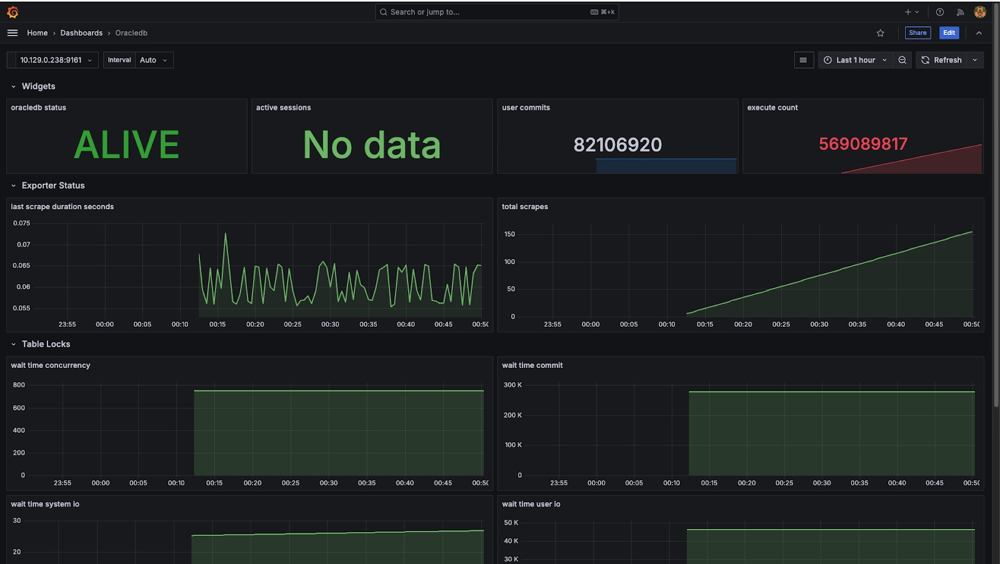
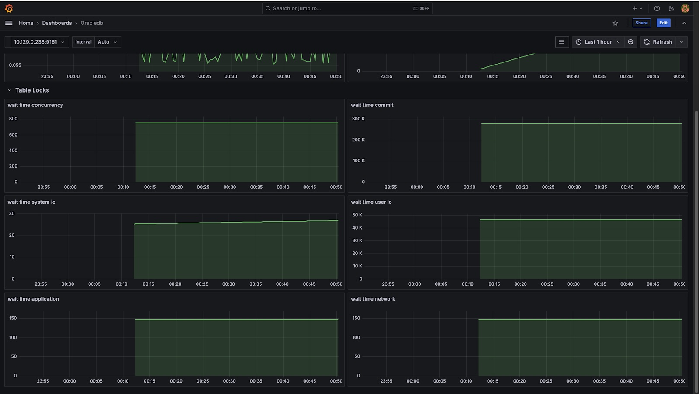
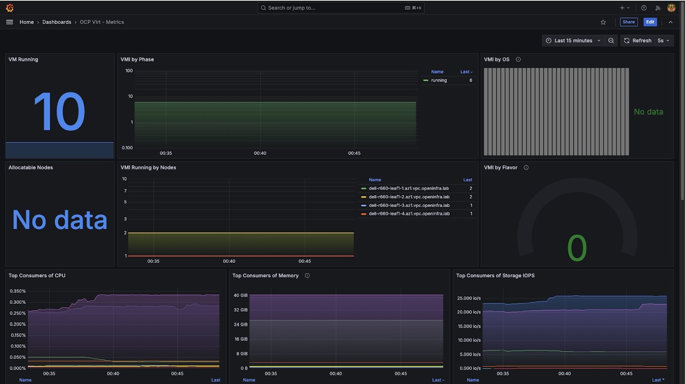
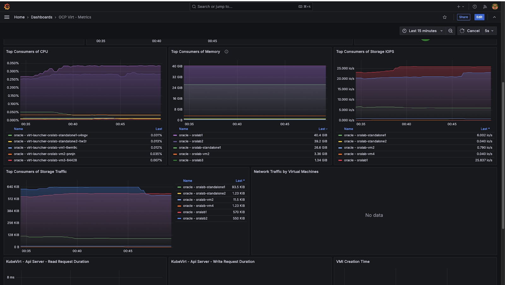
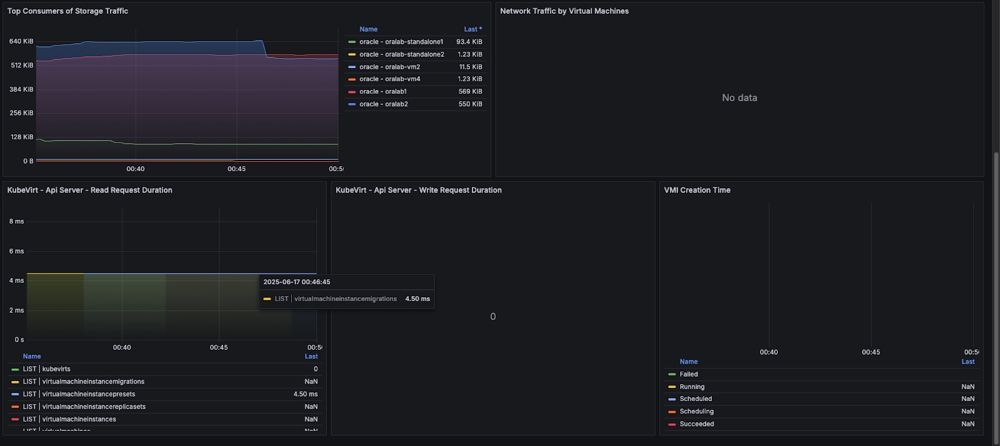

# 📊 Grafana Setup on OpenShift with Prometheus Datasource

This guide covers:

- Installing Grafana Operator on OpenShift
- Deploying a Grafana instance
- Retrieving Prometheus token and service URL
- Accessing Grafana UI
- Manually adding Prometheus datasource
- Import the dashboards

---

## 🧱 Prerequisites

- OpenShift CLI (`oc`) installed and configured
- User with appropriate permissions
- Prometheus deployed by OpenShift Monitoring (`openshift-monitoring` namespace)

---

## Step 1: Install Grafana Operator via OperatorHub

Login to openshift console and install the grafana operator. Operators --> OperatorHub --> search for grafana --> Install the grafana operator.

Once you install wait for some time to initialize the operator.

## Step 2: Deploy a Grafana Instance
Go to Operators --> installed operators --> Grafana Operator --> ALl instances --> "Create new" dropdown --> select grafana and fill the details you want to modify from default values.

Wait for the grafana pod to be initialized. This may not create an openshift route for you. If not create a route so that you can access the grafana outside the cluster. 


## Step 3: Get Prometheus Token

We are planning to use the prometheus instance available with openshift cluster. To access the prometheus token outside the cluster we need to get the token. This step will generate the token which does not expire.

Create a manual secret of type `kubernetes.io/service-account-token`:
```shell
oc create secret generic prometheus-k8s-token \
  --type kubernetes.io/service-account-token \
  --from-literal=extra=unused \
  -n openshift-monitoring
```
Then link it to the `prometheus-k8s` ServiceAccount. This will trigger the token controller to populate the secret with a long-lived token.
```shell
oc patch secret prometheus-k8s-token \
  -p '{"metadata":{"annotations":{"kubernetes.io/service-account.name":"prometheus-k8s"}}}' \
  -n openshift-monitoring
```
Wait a few seconds, then verify if the token is updated/created. Capture this token and you need this in the next step.

```shell
oc get secret prometheus-k8s-token -n openshift-monitoring -o jsonpath='{.data.token}' | base64 -d
```

## Step 4: Log in to Grafana

Once you find the grafana route to access the web application then you need login credentials.

Grafana operator creates the secret to access the grafana console. usually it wil be `<grafan-instance-name>-admin-credentials`. This secret is going to have credentials to login into the grafana console.

https://thanos-querier.openshift-monitoring.svc:9091


## Step 5: Manually Add Prometheus Datasource

After logging into Grafana:

1. Navigate to **⚙️ Configuration** → **Data Sources**
2. Click **"Add data source"**
3. Select **Prometheus**
4. In the settings form, enter the following details:

   | Field     | Value                                                                 |
      |-----------|-----------------------------------------------------------------------|
   | **Name**  | `OpenShift Prometheus`                                               |
   | **Prometheus server URL**      | `https://thanos-querier.openshift-monitoring.svc:9091`               |

5. Scroll down to the **HTTP Headers** section:
    - Add Header as `Authorization`
    - Add the header value as `Bearer <REPLACE_PROMOTHEUS_TOKEN>` ## Paste the token retrieved in **Step 3: Get Prometheus Token**

6. Under TLS Settings --> Enable "Skip TLS certificate validation"
7. Click **Save & Test**

You should see ✅ **"Data source is working"**

## Step 6: Import the grafana dashboards.

Import the required dashboards you want to monitor. Go to dashboards and import the below dashboards.

* Import the oracledb monitoring performance and table space stats.
  https://grafana.com/grafana/dashboards/13555-oracledb-monitoring-performance-and-table-space-stats/
* Import the simple oracledb monitoring
  https://grafana.com/grafana/dashboards/3333-oracledb/
* Import the openshift virutalization dashboard from the URL
  https://raw.githubusercontent.com/leoaaraujo/articles/master/openshift-virtualization-monitoring/files/ocp-v-dashboard.json

You can find some sample screenshots captured after deploying on one of our openshift cluster.

Oracle Database Observability Grafana Dashboard, this is configured on oracle standalone database.




Openshift Virtualization Observability Grafana Dashboard:


